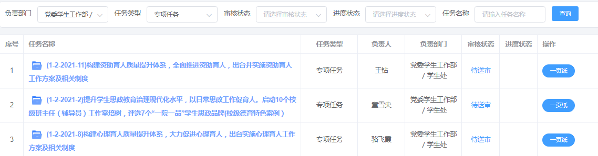

# 2.3 主要操作问答

## 2.3.1 如何查看本人负责与协作的任务？

答：登陆后，点击首页“负责任务”可以查看本人的所有负责任务，点击“协作任务”可以查看本人协作的所有任务。

## 2.3.2 作为三级任务负责人，我现在需要做什么？

答：目前质管办工作人员已在平台输入所有的双高建设一级、二级、三级任务（依据双高办5月10日提供的学校省“双高”2021年建设任务书），三级任务负责人还需完成以下内容：
1. 点击图标，完善三级任务基本信息，包括任务目标、成本等。
2. 点击三级任务名称后进入四级任务列表页面，点击“新增主要任务”按钮，添加主要任务（四级任务），将三级任务细化，落地，并实现一页纸报表展示。
3. 点击图标，进行办理，填写“概述和预测”，对任务当前的运行情况进行评价，移动经费滑动块，修改经费使用情况，并填写使用经费使用说明。
4. 对三级任务基本信息编辑完成，添加完四级任务后，点击图标送由二级任务负责人审核。审核完成后三级任务才能正常显示使用。

## 2.3.3 作为二级任务负责人，我现在需要做什么？

答：三级任务负责人补充信息完成后，会将其送审给对应二级任务负责人审核。二级任务负责人可以在“首页->审核任务”中查看，点击审核按钮，点击审核按钮完成审核。

## 2.3.4 作为主要任务（四级任务）负责人，我需要做什么？

答：主要任务（四级任务）负责人需要定期（每月或者每周）提交任务执行状态，选择“完成”、“预警”、“未完成”、“超额”四个状态之一，如果不是“完成”状态，需要填写原因。

## 2.3.5 作为领导如何查看任务总体完成情况？

答：点击左部导航栏中的“目标任务”链接，默认显示专项任务的“双高建设”任务列表。列表直接呈现一级、二级任务。其中二级任务的进度状态中，将显示其下属三级任务的“完成”，“预警”，“未完成”的数量。点击二级任务名称，将进入三级任务列表，在进度状态可以查看该任务的状态。

> 由于三级任务是一个整体，因此三级任务的状态以下级风险程度最高的任务作为任务风险。

## 2.3.6 作为领导如何快速检索查看某些三级任务的进度？

答：在首页中，领导有“任务查询”功能（后期可根据实际需求根据角色开放），可以设定“负责部门”、“任务类型”、“审核状态”、“进度状态”、“任务名称”等条件，点击“查询”按钮快速查看三级任务的进度、一页纸报表等信息。如下图所示：

## 2.3.7 学校省“双高”2021年建设任务书中有，但是任务列表中没有怎么办?

答：由于某些条目不符合要求或者输入遗漏，可能在任务列表中没有。该三级任务条目可由归属的二级任务负责部门中任一工作人员输入，或者联系方仁富代为输入。

## 2.3.8 遇到技术或操作问题怎么办？

答：可通过钉钉或者拨打手机短号624074联系质量管理办公室方仁富。